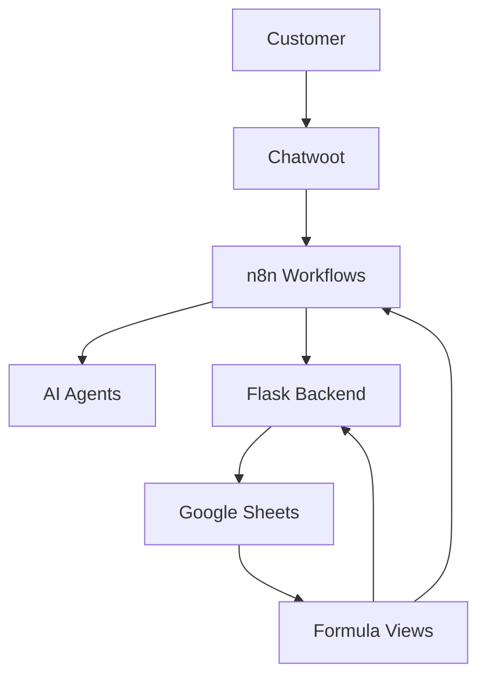

# Project Overview

## Purpose

The Amadeus Pig Tracking and Sales System automates livestock sales conversations, order creation, pig reservation, and customer handling with minimal manual intervention.

## Main System Layers

## Layer Responsibilities

| Layer | Responsibility |
| --- | --- |
| Chatwoot | Receives and sends customer messages. |
| n8n | Orchestrates workflows, branches, tools, and handoffs. |
| AI agents | Understand customer intent and prepare sales/customer replies. |
| Flask backend | Executes order logic, validation, reservations, lifecycle changes, and safe writes. |
| Google Sheets | Stores source data, logs, registers, pricing, and formula-driven views. |
| Web app | Gives humans operational control over orders, pigs, logs, and manual fixes. |

## Current Project Focus

The project is moving from documentation alignment into order stabilization.

The immediate focus is not broad feature expansion. The priority is making the order path reliable because it is live and profit-critical.

## Current Priority Path

1. Stabilize order lifecycle: reject, cancel, release, and reservation safety.
2. Stabilize requested item sync for split requests such as male/female order lines.
3. Add safe backend/Order Steward order review for Sam.
4. Improve the web app order experience after backend behavior is safe.
5. Return to broader workflow and media improvements after order operations are reliable.
