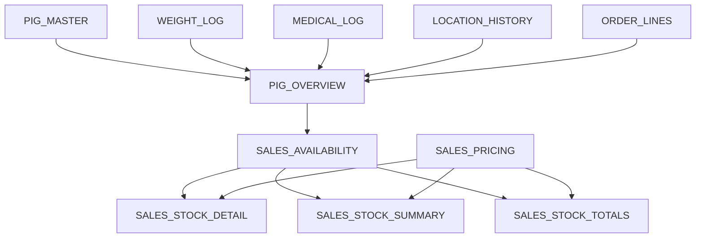

# Formula Logic

## Purpose

This document explains the main formula chains in the Google Sheets layer. Exact formulas live in the matching `sheets/*.md` files.

## Core Formula Chain

## `PIG_OVERVIEW`

`PIG_OVERVIEW` calculates the live operational state of each pig from master data and logs.

It derives:

- age and stage
- current and previous weight
- weight gain metrics
- current pen
- withdrawal status
- sale readiness
- reserved order reference and reserved status
- attention flags

## `SALES_AVAILABILITY`

`SALES_AVAILABILITY` is the sales eligibility gate. A pig should only appear here when it passes the required sale logic from `PIG_OVERVIEW`.

It controls:

- whether a pig is available for sale
- sale category
- weight band
- suggested price category key
- eligibility for AI responses and backend order matching

Sale-ready rows must require `Purpose = Sale` upstream in `PIG_OVERVIEW.Is_Sale_Ready`. Animals with `Purpose = Grow_Out`, `Unknown`, `Breeding`, `Replacement`, or `House_Use` must not be treated as available-for-sale stock.

## `SALES_STOCK_DETAIL`, `SALES_STOCK_SUMMARY`, And `SALES_STOCK_TOTALS`

These sheets summarize stock for sales workflows and AI responses.

They use:

- `SALES_AVAILABILITY` for sale-ready animals
- `SALES_PRICING` for price ranges
- selected `PIG_OVERVIEW` rules for newborn/not-for-sale visibility

Newborn animals may be visible for information, but they must not be treated as available for sale until the sale gate allows it.

Open alignment note from 2026-05-10: the live stock summary/detail/totals views include a `Newborn` information row that bypasses `SALES_AVAILABILITY` and counts non-sale-ready newborns from `PIG_OVERVIEW`. This explains why the stock display total can be higher than `SALES_AVAILABILITY`. Keep this explicitly separated from sale-ready totals or move it to an information-only view/tool before relying on broad stock totals in Sam wording.

## `ORDER_OVERVIEW`

`ORDER_OVERVIEW` derives order display and reporting data from `ORDER_MASTER`, `ORDER_LINES`, and status history.

Operational order changes must be made in `ORDER_MASTER` and `ORDER_LINES`, not in the overview.

**`Line_Count`** counts every matching row in `ORDER_LINES` for the order, **including cancelled** historical rows — see `sheets/ORDER_OVERVIEW.md`. For “active line” counts, use API `order.active_line_count` from `GET /api/orders/<id>` or filter lines by `Line_Status != Cancelled` in tooling.

## `LITTER_OVERVIEW`

`LITTER_OVERVIEW` calculates litter counts, sex assignment, active/on-farm counts, weight averages, age range, and attention flags from `LITTERS`, `PIG_MASTER`, and `PIG_OVERVIEW`.

## `MATING_OVERVIEW`

`MATING_OVERVIEW` calculates breeding status, expected pregnancy check dates, expected farrowing dates, outcome, open status, and overdue flags from `MATING_LOG`, `LITTERS`, and related pig data.

## Formula Maintenance Rules

- Update the per-sheet doc when a formula changes.
- Update this file when a formula chain or dependency changes.
- Never document formula outputs as manual write targets.
- If a calculated value is wrong, inspect the source sheet and formula first.
