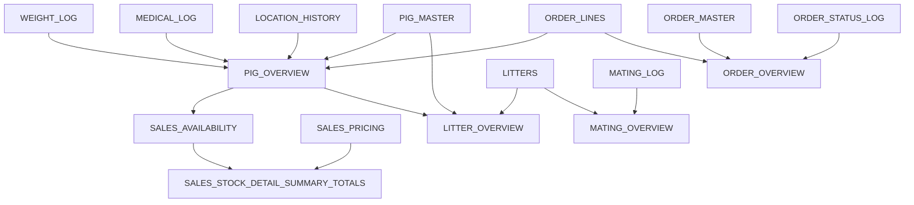

# Sheet Schema

## Purpose

This document defines the Google Sheets data model at system level. The detailed column and formula information lives in the matching file under `sheets/`.

## Sheet Classification

### Master / Source-Of-Truth Sheets

These sheets hold operational data. Approved backend or admin tooling may write to them.

| Sheet | Purpose |
| --- | --- |
| `PIG_MASTER` | Main pig record source. |
| `ORDER_MASTER` | Order header source. |
| `ORDER_LINES` | Order line and reservation source. |
| `LITTERS` | Litter record source. |

### Log / History Sheets

These sheets append or record events over time.

| Sheet | Purpose |
| --- | --- |
| `WEIGHT_LOG` | Pig weight history. |
| `MEDICAL_LOG` | Medical treatment and withdrawal history. |
| `MATING_LOG` | Breeding and mating transaction records. |
| `ORDER_STATUS_LOG` | Order status audit trail. |
| `LOCATION_HISTORY` | Pig pen/location movement history. |

### Register / Reference Sheets

These sheets hold controlled lookup or admin data.

| Sheet | Purpose |
| --- | --- |
| `PEN_REGISTER` | Pen/location reference data. |
| `PRODUCT_REGISTER` | Medical/product reference data. |
| `USERS` | User/admin records. |
| `SALES_PRICING` | Manual pricing source for sales categories and weight bands. |

### Formula Overview Sheets

These sheets calculate operational views. They are read-only outputs.

| Sheet | Depends on | Purpose |
| --- | --- | --- |
| `PIG_OVERVIEW` | `PIG_MASTER`, `WEIGHT_LOG`, `MEDICAL_LOG`, `LOCATION_HISTORY`, `ORDER_LINES` | Live pig operational view. |
| `MATING_OVERVIEW` | `MATING_LOG`, `LITTERS`, `PIG_MASTER` | Breeding status and expected date view. |
| `LITTER_OVERVIEW` | `LITTERS`, `PIG_MASTER`, `PIG_OVERVIEW` | Litter counts, age, sex, weight, and status view. |
| `ORDER_OVERVIEW` | `ORDER_MASTER`, `ORDER_LINES`, `ORDER_STATUS_LOG` | Order display and reporting view. |
| `SALES_AVAILABILITY` | `PIG_OVERVIEW` | Sellable pig gate for AI, n8n, and order matching. |

### Sales Display Sheets

These sheets summarize `SALES_AVAILABILITY` and pricing for customer-facing sales context. They are read-only.

| Sheet | Purpose |
| --- | --- |
| `SALES_STOCK_DETAIL` | Detailed availability rows for sales conversations. |
| `SALES_STOCK_SUMMARY` | Grouped availability by sale category and weight band. |
| `SALES_STOCK_TOTALS` | Higher-level category totals and stock status. |

## Relationship Map

## Source-Of-Truth Rule

If a master/log/register sheet and a formula sheet disagree, trace the formula sheet back to its source data. Do not manually fix a calculated output cell.

## Pending Manual Column Additions

These columns must be added to their sheet manually in Google Sheets before the related backend code is deployed.

| Sheet | Column | Values | Added by | Required for |
| --- | --- | --- | --- | --- |
| `ORDER_MASTER` | `PaymentMethod` | `Cash` or `EFT` | Manual — Phase 1.3 prerequisite | Backend PATCH, send_for_approval validation, quote/invoice VAT calculation |

Notes:
- `PaymentMethod` must be present in the sheet before the Phase 1.3 backend update is deployed.
- `Cash` = order totals use ex-VAT unit prices as listed. No VAT added.
- `EFT` = order totals add 15% VAT on top of the ex-VAT unit price.
- `PaymentMethod` is locked once `Order_Status` reaches `Pending_Approval` or later. Backend enforces this; manual overrides require deliberate admin tooling.

## Per-Sheet Details

Use the files under `sheets/` for exact columns, formulas, hard-coded values, and sheet-specific notes.
