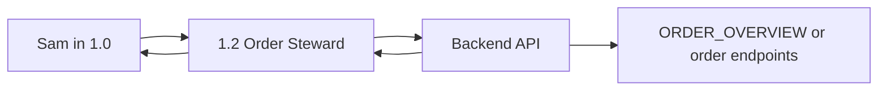

# Data Flow

## Purpose

Defines the field contracts and data movement across the n8n workflow suite.

## Core Principle

Every important field must have one clear owner. Fields may be copied forward, but they must not be silently reinterpreted by unrelated nodes.

## `1.0` Inbound Chatwoot Contract

Created or normalized by `Code - Normalize Incoming Message` and nearby Chatwoot ID nodes.

| Field | Meaning | Notes |
| --- | --- | --- |
| `CustomerName` / `contact_name` | Customer display name. | Used by Sam and order payloads. |
| `CustomerMessage` / `customer_message` | Customer message text. | Voice notes must be transcribed before this is trusted. |
| `Channel` | Source channel. | Usually Chatwoot/inbox derived. |
| `UserID` / `ContactId` | Customer/contact identifier. | Used for continuity and order context. |
| `AccountId` / `account_id` | Chatwoot account ID. | Needed for Chatwoot API calls. |
| `ConversationId` / `conversation_id` | Chatwoot conversation ID. | Needed for replies, attributes, history, and media. |
| `InboxId` / `inbox_id` | Chatwoot inbox ID. | Needed by some tool calls. |
| `ExistingOrderId` | Order ID stored on Chatwoot custom attributes. | Used when enriching/syncing existing drafts. |
| `ExistingOrderStatus` | Order status stored on Chatwoot custom attributes. | Context only unless validated downstream. |
| `ConversationMode` / `conversation_mode` | AUTO or HUMAN mode. | HUMAN should stop Sam from replying. |
| `PendingAction` / `pending_action` | Pending guarded action from Chatwoot custom attributes. | Currently used for two-turn customer cancellation. |

Full Chatwoot label and custom attribute contracts are documented in `CHATWOOT_ATTRIBUTES.md`.

## Decision Fields

| Field | Owner | Purpose |
| --- | --- | --- |
| `decision_mode` | Escalation classifier parse/normalization path | Authoritative branch: `AUTO`, `CLARIFY`, or `ESCALATE`. |
| `escalation_raw_output` | Classifier normalization | Preserved classifier response. Never customer-facing. |
| `ai_reply_output` | AI Sales Agent normalization | Preserved Sam reply, especially important for CLARIFY. |
| `cleaned_reply` | Clean final reply node | Only field that should be sent as customer reply from `1.0`. |
| `output` | Temporary AI/tool field | High risk. Do not treat as globally safe after merges. |

## `1.0` Order State Contract

`Code - Build Order State` and related route nodes build `order_state`.

Important fields:

- `customer_name`
- `customer_channel`
- `customer_language`
- `customer_number`
- `conversation_id`
- `contact_id`
- `existing_order_id`
- `requested_category`
- `requested_weight_range`
- `requested_sex`
- `requested_quantity`
- `collection_location`
- `notes`
- `requested_items[]`

## Planned Persistent Order Intake State

Status: planned after Phase 5.3; do not implement until the design is agreed and sheet schemas are documented.

Current issue:

- Sam's natural language reply can contain the right order details while the deterministic `order_state` no longer has those fields.
- Rebuilding order facts from the last N Chatwoot messages is not reliable enough for operational order capture.
- A formal quote must be a backend-generated PDF from order/document state, not just a chat summary.

Target ownership:

| Layer | Ownership |
| --- | --- |
| Backend | Intake state, missing-field calculation, next action, draft creation/update, line sync, quote/invoice generation. |
| Google Sheets | Persistent intake state and item rows until a stronger database exists. |
| n8n | Orchestration only: normalize message, call backend, pass compact context to Sam, call approved action branches. |
| Chatwoot attributes | Lightweight routing hints only, not intake truth. |
| Sam | Natural language reply and one clear next question; not operational source of truth. |

Target flow:

1. Customer sends a message.
2. `1.0` normalizes the message and calls backend intake update.
3. Backend merges newly confirmed facts into existing intake state.
4. Backend returns known fields, `missing_fields`, `next_action`, and safe reply facts.
5. Sam asks the next missing field or confirms the backend action result.
6. If intake is complete and customer requests a formal quote, n8n/backend creates or updates the draft, syncs lines, generates a quote PDF, and uses the document delivery path.
7. If customer wants to proceed, n8n/backend creates or updates the draft and syncs lines.

Planned cleanup rule:

- Do not remove existing `1.0` payload fields or Chatwoot attributes until intake state has passed shadow-mode verification and live draft/quote tests.

## Draft order context prefetch (`get_order_context`)

Before `Switch - Clarify or Auto` on the AUTO preparation path, when `sales_agent_memory.existing_order_id` (or equivalent) is non-empty, `1.0` calls `1.2` with `action: get_order_context`. The steward performs `GET /api/orders/<order_id>` and returns:

| Field | Meaning |
| --- | --- |
| `order_context_fetch_ok` | `true` only when the API returned `success` and a full order object. |
| `existing_order_context` | Slim bundle: `order` (header fields including `payment_method` from `ORDER_MASTER`) and `lines` (minimal line summary). Order includes **`line_count`** (sheet formula: all rows including **Cancelled**) and **`active_line_count`** (non-cancelled lines only — use this for “how many pigs/lines on the draft”) plus **`line_count_includes_cancelled: true`** as a hint for the model. |

**Merge rule in `Code - Build Order State`:** values extracted from the **current message** and Chatwoot attributes win. The fetched bundle fills **only** empty gaps for quantity, category, weight band, sex, collection location, and payment method (Cash/EFT). This avoids Sam re-asking for payment or header fields already stored on the draft when the customer says “Cash” or “send for approval” in a short follow-up.

The CLARIFY branch does not wait through this fetch; only the AUTO path uses prefetch.

## Active customer order lookup fallback (`get_active_customer_order_context`)

When there is no exact `ExistingOrderId`, `1.0` can call `1.2` with `action: get_active_customer_order_context`, but only for saved-order review/cancel/document-style messages such as:

- "What is on my order?"
- "Order status"
- "Is my order approved?"
- "Cancel my order"
- "Send my quote/invoice"

Normal new sales messages must not trigger this lookup. If an exact `ExistingOrderId` is present, the existing `get_order_context` path still wins.

The fallback sends `conversation_id` and `customer_phone` when available. The steward calls backend `GET /api/orders/active-customer-context`.

Handling rules:

- `single_match`: injects the returned safe context into the existing `existing_order_context` path and exposes a compact active-order summary to Sam.
- `multiple_matches`: exposes only short match summaries so Sam can ask one disambiguation question.
- `no_match`: Sam should not invent an order; it should ask for the order reference or continue normal flow.
- `terminal_order`: Sam may explain that the exact order is not active when that status is returned by the backend.

## `1.0` Sales Agent Input Contract (Phase 1.7)

`Code - Slim Sales Agent User Context` runs immediately before `Ai Agent - Sales Agent` on all four main input paths. It produces two new fields and spreads the full item so all downstream routing and tool nodes continue to receive the complete payload.

| Field | Source | Purpose |
| --- | --- | --- |
| `sam_order_state_slim` | Whitelisted copy of `order_state` | Safe, minimal order context for Sam's prompt. See whitelist below. |
| `sam_steward_result_compact` | Short summary from steward fields on the merged item | When present: `success`, `message` (truncated), `backend_success`, `backend_error` (truncated), `complete_fulfillment`, `fulfillment_status`, `partial_fulfillment`, `had_partial`, `had_no_match`, `had_incomplete`, aggregate totals, optional **`partial_stock_detail`** (structured text: requested vs lined + same-category alternative bands), `summary`, `had_errors`. Does not duplicate `order_id` / `order_status` (those remain on the merged item and in the Sales Agent user template). |

`sam_order_state_slim` whitelist (matches `Code - Slim Sales Agent User Context` in `1.0` export):

- `customer_name`, `customer_language`
- `existing_order_id`, `existing_order_status`
- `conversation_mode`, `pending_action` (when non-empty)
- `payment_method` — only if `Cash` or `EFT`, resolved from `detected_payment_method` first, else `payment_method`
- `requested_quantity`, `requested_category`, `requested_weight_range`, `requested_sex`, `timing_preference`, `collection_location`
- Intent / draft flags when defined on `order_state`: `quote_intent`, `order_commitment_intent`, `conversation_commitment_intent`, `cancel_order_intent`, `send_for_approval_intent`, `has_existing_draft`
- `requested_items_compact` — up to **5** entries from `requested_items`, each `{ qty, sex, category, weight_range }`

**Not** copied into slim (still on the full item for routing / other nodes): `customer_channel`, `conversation_id`, `contact_id`, full `requested_items`, `notes`, `order_route` (Sam still sees route as **`OrderAction`** in the user prompt from top-level `order_route`).

The Sales Agent prompt reads `OrderStateSummary` (from `sam_order_state_slim`) and `StewardCompact` (from `sam_steward_result_compact`) instead of stringifying the raw `order_state` object. Raw Chatwoot webhook data, debug fields, and sync internals remain on the item upstream but are not injected into Sam's prompt as full `order_state` JSON.

## `1.0` To `1.2` Contract

Discriminator field: `action`.

Currently live actions called by `1.0`:

| Action | Purpose | Required core fields |
| --- | --- | --- |
| `create_order` | Create a new draft order. | Customer fields, requested category/weight/sex/quantity, notes, conversation/contact IDs. |
| `create_order_with_lines` | Create a new draft order and immediately sync requested order lines in one `1.2` execution. | Same as `create_order`, plus `requested_items[]` and `changed_by`. |
| `update_order` | Update/enrich an existing draft header. | `order_id`, changed fields, `changed_by`. |
| `sync_order_lines_from_request` | Sync order lines from structured requested items. | `order_id`, `requested_items[]`, `changed_by`. Response includes `complete_fulfillment`, `fulfillment_status`, quantity totals, and `partial_fulfillment`/`incomplete_items` when any requested item is short or no-match. |
| `get_order_context` | Read-only draft context for Sam state merge. | `order_id`, `changed_by` (optional). Returns `order_context_fetch_ok`, `existing_order_context`. |
| `get_active_customer_order_context` | Read-only active-order lookup for missing/stale Chatwoot order IDs. | `order_id`, `conversation_id`, or `customer_phone`. Calls backend `GET /api/orders/active-customer-context` and returns `lookup_status`, `match_count`, `active_order_context`, and `active_order_matches`. |
| `cancel_order` | Customer-confirmed cancellation of an active order. | `order_id`, `changed_by`, optional `reason`. |
| `send_for_approval` | Submit draft to pending approval (`POST /api/orders/<order_id>/send-for-approval`). | `order_id`, `changed_by`; caller must satisfy backend guards (Draft, payment method, lines, etc.). |

Rule: `1.2` should call the backend API. It should not directly write order sheets.

`requested_items[]` metadata rule: `intent_type` may be `primary`, `addon`, `nearby_addon`, or `extractor_slot` and is only a source label. `status` must be `active`; if `1.0` does not want an item synced, it must omit that item rather than sending `inactive` or `cancelled`.

First-turn committed orders use `create_order_with_lines` when `1.0` has already built non-empty `requested_items[]`. `1.0` decides that action, but `1.2` owns the full create + sync operation and returns a combined result. Top-level `success` means both the draft creation and line sync succeeded.

Customer cancel confirmation state is stored in Chatwoot custom attributes as `pending_action = cancel_order`; it is set by `1.0`, cleared by `1.0`, and never written to Google Sheets.

## Backend To `1.4` Outbound Notification Contract

`approve_order()` and `reject_order()` call `ORDER_NOTIFICATION_WEBHOOK_URL` after the backend transition succeeds.

Payload fields:

| Field | Meaning |
| --- | --- |
| `event_type` | `order_approved` or `order_rejected`. |
| `order_id` | Backend order ID. |
| `conversation_id` | Chatwoot conversation ID stored on `ORDER_MASTER.ConversationId`. Required for sending. |
| `message_text` | Exact customer-facing message to send. `1.4` must not rewrite it. |
| `customer_name`, `customer_phone`, `customer_channel` | Context for logging/debugging. |
| `order_status`, `approval_status` | Backend-confirmed state after the transition. |
| `changed_by` | Actor that triggered the transition. |
| `extra` | Transition-specific metadata, such as reservation warnings or cancelled line count. |

Failure rule: delivery failure must return an error to backend, but the order transition remains committed and backend logs a warning for manual follow-up.

## Backend To `1.5` Document Delivery Contract

`POST /api/order-documents/<document_id>/send` calls `DOCUMENT_DELIVERY_WEBHOOK_URL` after a generated document is selected for delivery.

Payload fields:

| Field | Meaning |
| --- | --- |
| `event_type` | Always `order_document_delivery`. |
| `account_id` | Chatwoot account ID, normally `147387`. |
| `conversation_id` | Required Chatwoot conversation ID. No fallback should be assumed. |
| `document_id` | Backend document ID from `ORDER_DOCUMENTS`. |
| `order_id` | Linked order ID. |
| `document_type` | `Quote` or `Invoice`. |
| `document_ref` | Backend-generated document reference. |
| `file_name` | PDF file name stored in Drive. |
| `google_drive_file_id` | Drive file ID to download. |
| `message_text` | Customer-facing message text to send with the attachment. |

Failure rule: backend marks the document `Sent` only when the workflow returns a successful response. For Phase 2.5 tests, the request must explicitly use `conversation_id = 1742`.

## Preferred Order Review Path

Sam needs better order awareness, but the preferred implementation is not a direct `ORDER_OVERVIEW` Google Sheets tool inside `1.0`.

Preferred path:

Reason:

- backend can validate customer identity and order ownership
- backend can filter only relevant orders
- backend can hide internal fields
- one API contract is easier to test than giving the AI direct sheet access

Direct read access to `ORDER_OVERVIEW` may be used for diagnostics, but should not be the first production design for customer-specific order context.

## Escalation Data Flow: `1.0` To `1.1`

`1.0` creates the human handoff by:

- creating an escalation/ticket record in the handoff Google Sheet
- sending a Telegram alert to the human channel
- setting Chatwoot context so Sam does not keep responding while human help is active

`1.1` completes the handoff by:

- parsing the human Telegram reply and ticket ID
- finding the matching row in the handoff sheet
- sending the human reply to Chatwoot
- updating the handoff row status
- returning `conversation_mode` to `AUTO`
- deleting Telegram messages when cleanup is implemented

## Media Data Flow: `1.0` To `1.3`

Current status: disabled until fixed and tested.

Expected input fields when enabled:

- `account_id`
- `conversation_id`
- `inbox_id`
- `category_key`
- `send_mode`
- `count`

Important output/side effect:

- Chatwoot media attachment sent
- `images_sent_offset_map` custom attribute updated

## Google Sheets Read Surfaces

`1.0` may read these sales sheets through tools:

- `SALES_STOCK_SUMMARY`
- `SALES_STOCK_TOTALS`
- `SALES_STOCK_DETAIL`
- `SALES_AVAILABILITY`

These are read-only. Workflow logic must not write to sales stock or availability sheets.
