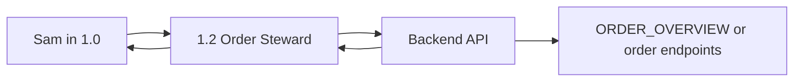

# Data Flow

## Purpose

Defines the field contracts and data movement across the n8n workflow suite.

## Core Principle

Every important field must have one clear owner. Fields may be copied forward, but they must not be silently reinterpreted by unrelated nodes.

## `1.0` Inbound Chatwoot Contract

Created or normalized by `Code - Normalize Incoming Message` and nearby Chatwoot ID nodes.

| Field | Meaning | Notes |
| --- | --- | --- |
| `CustomerName` / `contact_name` | Customer display name. | Used by Sam and order payloads. |
| `CustomerMessage` / `customer_message` | Customer message text. | Voice notes must be transcribed before this is trusted. |
| `Channel` | Source channel. | Usually Chatwoot/inbox derived. |
| `UserID` / `ContactId` | Customer/contact identifier. | Used for continuity and order context. |
| `AccountId` / `account_id` | Chatwoot account ID. | Needed for Chatwoot API calls. |
| `ConversationId` / `conversation_id` | Chatwoot conversation ID. | Needed for replies, attributes, history, and media. |
| `InboxId` / `inbox_id` | Chatwoot inbox ID. | Needed by some tool calls. |
| `ExistingOrderId` | Order ID stored on Chatwoot custom attributes. | Used when enriching/syncing existing drafts. |
| `ExistingOrderStatus` | Order status stored on Chatwoot custom attributes. | Context only unless validated downstream. |
| `ConversationMode` / `conversation_mode` | AUTO or HUMAN mode. | HUMAN should stop Sam from replying. |
| `PendingAction` / `pending_action` | Pending guarded action from Chatwoot custom attributes. | Currently used for two-turn customer cancellation. |

Full Chatwoot label and custom attribute contracts are documented in `CHATWOOT_ATTRIBUTES.md`.

## Decision Fields

| Field | Owner | Purpose |
| --- | --- | --- |
| `decision_mode` | Escalation classifier parse/normalization path | Authoritative branch: `AUTO`, `CLARIFY`, or `ESCALATE`. |
| `escalation_raw_output` | Classifier normalization | Preserved classifier response. Never customer-facing. |
| `ai_reply_output` | AI Sales Agent normalization | Preserved Sam reply, especially important for CLARIFY. |
| `cleaned_reply` | Clean final reply node | Only field that should be sent as customer reply from `1.0`. |
| `output` | Temporary AI/tool field | High risk. Do not treat as globally safe after merges. |

## `1.0` Order State Contract

`Code - Build Order State` and related route nodes build `order_state`.

Important fields:

- `customer_name`
- `customer_channel`
- `customer_language`
- `customer_number`
- `conversation_id`
- `contact_id`
- `existing_order_id`
- `requested_category`
- `requested_weight_range`
- `requested_sex`
- `requested_quantity`
- `collection_location`
- `notes`
- `requested_items[]`

## `1.0` Sales Agent Input Contract (Phase 1.7)

`Code - Slim Sales Agent User Context` runs immediately before `Ai Agent - Sales Agent` on all four main input paths. It produces two new fields and spreads the full item so all downstream routing and tool nodes continue to receive the complete payload.

| Field | Source | Purpose |
| --- | --- | --- |
| `sam_order_state_slim` | Whitelisted copy of `order_state` | Safe, minimal order context for Sam's prompt. See whitelist below. |
| `sam_steward_result_compact` | Short summary from `1.2` result fields | Backend action outcome (success, order_id, order_status, message, first error). Only present when a steward action was called. |

`sam_order_state_slim` whitelist:

- `customer_name`, `customer_channel`, `customer_language`, `customer_number`
- `conversation_id`, `contact_id`
- `existing_order_id`, `existing_order_status`
- `order_route`
- `payment_method` — resolved from `detected_payment_method` first, then `payment_method`; must be `Cash` or `EFT`, otherwise omitted
- `send_for_approval_intent`, `cancel_pending_action`
- `requested_items` — each item compacted to `{ key, quantity, category, sex }` only
- `collection_location`, `notes`

The Sales Agent prompt reads `OrderStateSummary` (from `sam_order_state_slim`) and `StewardCompact` (from `sam_steward_result_compact`) instead of the raw `order_state` object. Raw Chatwoot webhook data, debug fields, and sync internals remain available in earlier nodes but are not injected into Sam's prompt.

## `1.0` To `1.2` Contract

Discriminator field: `action`.

Currently live actions called by `1.0`:

| Action | Purpose | Required core fields |
| --- | --- | --- |
| `create_order` | Create a new draft order. | Customer fields, requested category/weight/sex/quantity, notes, conversation/contact IDs. |
| `create_order_with_lines` | Create a new draft order and immediately sync requested order lines in one `1.2` execution. | Same as `create_order`, plus `requested_items[]` and `changed_by`. |
| `update_order` | Update/enrich an existing draft header. | `order_id`, changed fields, `changed_by`. |
| `sync_order_lines_from_request` | Sync order lines from structured requested items. | `order_id`, `requested_items[]`, `changed_by`. |
| `cancel_order` | Customer-confirmed cancellation of an active order. | `order_id`, `changed_by`, optional `reason`. |
| `send_for_approval` | Submit draft to pending approval (`POST /api/orders/<order_id>/send-for-approval`). | `order_id`, `changed_by`; caller must satisfy backend guards (Draft, payment method, lines, etc.). |

Rule: `1.2` should call the backend API. It should not directly write order sheets.

First-turn committed orders use `create_order_with_lines` when `1.0` has already built non-empty `requested_items[]`. `1.0` decides that action, but `1.2` owns the full create + sync operation and returns a combined result. Top-level `success` means both the draft creation and line sync succeeded.

Customer cancel confirmation state is stored in Chatwoot custom attributes as `pending_action = cancel_order`; it is set by `1.0`, cleared by `1.0`, and never written to Google Sheets.

## Preferred Order Review Path

Sam needs better order awareness, but the preferred implementation is not a direct `ORDER_OVERVIEW` Google Sheets tool inside `1.0`.

Preferred path:

Reason:

- backend can validate customer identity and order ownership
- backend can filter only relevant orders
- backend can hide internal fields
- one API contract is easier to test than giving the AI direct sheet access

Direct read access to `ORDER_OVERVIEW` may be used for diagnostics, but should not be the first production design for customer-specific order context.

## Escalation Data Flow: `1.0` To `1.1`

`1.0` creates the human handoff by:

- creating an escalation/ticket record in the handoff Google Sheet
- sending a Telegram alert to the human channel
- setting Chatwoot context so Sam does not keep responding while human help is active

`1.1` completes the handoff by:

- parsing the human Telegram reply and ticket ID
- finding the matching row in the handoff sheet
- sending the human reply to Chatwoot
- updating the handoff row status
- returning `conversation_mode` to `AUTO`
- deleting Telegram messages when cleanup is implemented

## Media Data Flow: `1.0` To `1.3`

Current status: disabled until fixed and tested.

Expected input fields when enabled:

- `account_id`
- `conversation_id`
- `inbox_id`
- `category_key`
- `send_mode`
- `count`

Important output/side effect:

- Chatwoot media attachment sent
- `images_sent_offset_map` custom attribute updated

## Google Sheets Read Surfaces

`1.0` may read these sales sheets through tools:

- `SALES_STOCK_SUMMARY`
- `SALES_STOCK_TOTALS`
- `SALES_STOCK_DETAIL`
- `SALES_AVAILABILITY`

These are read-only. Workflow logic must not write to sales stock or availability sheets.
