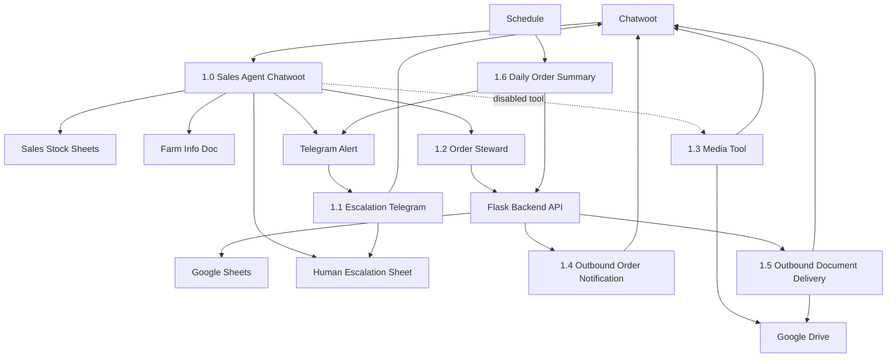

# n8n Documentation

## Purpose

This folder is the source of truth for the n8n workflow layer of the Amadeus Pig Tracking and Sales System.

It documents:

- the workflow suite and how each workflow relates to the others
- workflow exports and human-readable workflow notes
- node responsibilities and protected fields
- data contracts between Chatwoot, n8n, backend, Google Sheets, Telegram, Google Drive, and AI tools
- rules that must be followed before changing workflow behavior

## Workflow Suite

| Workflow | Folder | Status | Role |
| --- | --- | --- | --- |
| `1.0 - SAM - Sales Agent - Chatwoot` | `workflows/1.0 - Sam-sales-agent-chatwoot/` | Active hub | Main customer conversation workflow from Chatwoot. |
| `1.1 - SAM - Sales Agent - Escalation Telegram` | `workflows/1.1 - Sam - sales-agent-escalation-telegram/` | Active support workflow | Human reply handling from Telegram back to Chatwoot. |
| `1.2 - Amadeus Order Steward` | `workflows/1.2 - order-steward/` | Active worker workflow | Backend order actions called by `1.0`. |
| `1.3 - SAM - Sales Agent - Media Tool` | `workflows/1.3 - Sam-sales-agent-media-tool/` | Disabled until fixed | Sends media/images through Chatwoot when enabled. |
| `1.4 - Outbound Order Notification` | `workflows/1.4 - outbound-order-notification/` | Planned/import pending | Receives backend approval/rejection events and sends the customer Chatwoot message. |
| `1.5 - Outbound Document Delivery` | `workflows/1.5 - outbound-document-delivery/` | Live-verified 2026-05-10 | Receives backend document-delivery events and sends generated quote/invoice PDFs as Chatwoot attachments. |
| `1.6 - Daily Order Summary` | `workflows/1.6 - daily-order-summary/` | Manual-verified 2026-05-10, scheduled for 16:00 | Scheduled operations summary from backend report endpoint to Telegram. |
| `2 - The GateKeeper` | `workflows/2 - The GateKeeper/` | Active | Single Telegram entry point for Oom Sakkie messages and button callbacks. |
| `2.0 - OOM SAKKIE - Amadeus Assistant Agent` | `workflows/2.0 - OOM SAKKIE - Amadeus Assistant Agent/` | Active | Main internal Telegram assistant. |
| `2.1 - Amadeus Weather Sub-Agent` | `workflows/2.1 - Amadeus Weather Sub-Agent/` | Active | Weather sub-agent called by Oom Sakkie. |
| `2.1.1 - Amadeus Forecast Tool` | `workflows/2.1.1 - Amadeus Forecast Tool/` | Active | Focused Open-Meteo forecast utility. |
| `2.2 - Amadeus Sunsynk Sub-Agent` | `workflows/2.2 - Amadeus Sunsynk Sub-Agent/` | Active | Solar and power worker called by Oom Sakkie; reads backend current-power endpoint. |
| `2.3.1 - Build Daily Irrigation Plan` | `workflows/2.3.1 - Build Daily Irrigation Plan/` | Active | Scheduled daily irrigation planning. |
| `2.3.2 - Run Irrigation Controller` | `workflows/2.3.2 - Run Irrigation Controller/` | Inactive | Scheduled irrigation valve controller. |
| `2.3.3 - Irrigation Status Tool` | `workflows/2.3.3 - Irrigation Status Tool/` | Import/test pending | Read-only irrigation status worker called by Oom Sakkie; no hardware control. |
| `2.4 - Amadeus Orders Sub Agent` | `workflows/2.4 - Amadeus Orders Sub Agent/` | Active | Internal order approval sub-agent. |
| `2.4.1 - Test Caller` | `workflows/2.4.1 - Test Caller/` | Inactive | Manual test caller for the orders sub-agent. |
| `2.4.2 - Orders Approval Callback Handler` | `workflows/2.4.2 - Orders Approval Callback Handler/` | Retired / Inactive | Historical callback handler only; do not reactivate. Callback routing now lives in GateKeeper to avoid bot webhook conflicts. |
| `2.4.3 - Order Approval Request Webhook` | `workflows/2.4.3 - Order Approval Request Webhook/` | Active | Webhook entry for order approval requests. |
| `2.4.4 - Order Lookup Tool` | `workflows/2.4.4 - Order Lookup Tool/` | Active | Oom Sakkie order lookup and guarded quote-send preparation tool. |
| `2.4.5 - Document Send Callback Handler` | `workflows/2.4.5 - Document Send Callback Handler/` | Active | Worker workflow for guarded quote-send button callbacks. |
| `ALERT - Weather Backend Delivery` | `workflows/ALERT - Weather Backend Delivery/` | Active / Live-verified | Backend/Supabase weather alert delivery workflow. |
| `ALERT - Power Backend Delivery` | `workflows/ALERT - Power Backend Delivery/` | Active / Live-verified | Backend/Supabase Sunsynk power alert delivery workflow. |

## Folder Map

| File | Purpose |
| --- | --- |
| `WORKFLOW_MAP.md` | High-level suite map and workflow-by-workflow flow. |
| `DATA_FLOW.md` | Field contracts and cross-workflow payload movement. |
| `CHATWOOT_ATTRIBUTES.md` | Canonical Chatwoot labels, conversation attributes, contact attributes, and snapshot rules. |
| `NODE_RESPONSIBILITIES.md` | Node and workflow responsibilities. |
| `WORKFLOW_RULES.md` | Rules for AUTO, CLARIFY, ESCALATE, order tools, media, and human handoff. |
| `DO_NOT_CHANGE.md` | Protected fields, routes, node contracts, and fragile behavior. |
| `CHANGELOG.md` | n8n documentation and workflow change history. |
| `OOM_SAKKIE_ROUTING_ARCHITECTURE_PLAN.md` | Proposed clean single-trigger Oom Sakkie architecture for Claude/owner review before rebuilding. |
| `OOM_SAKKIE_MANUAL_RECOVERY_CHECKLIST.md` | Manual n8n recovery/import checklist for the Oom Sakkie Telegram routing issue. |
| `workflows/` | One folder per n8n workflow with `README.md` and `workflow.json`. |
| `workflows/OOM_SAKKIE_ORDER_LOOKUP_PLAN.md` | Phase 7.3 planning for internal Oom Sakkie order/document lookup before implementation. |

Removed legacy workflow exports:

- `workflows/ALERT - Sunsynk/` was removed after `ALERT - Power Backend Delivery` was made live and verified on 2026-05-23.
- `workflows/ALERT - Local Weather Station/` and `workflows/ALERT - Weather Forecast/` were removed after `ALERT - Weather Backend Delivery` was made live and verified.

## Core Architecture

## Current Build Decisions

- `1.0` is the only customer-entry workflow.
- `1.2` is the preferred path for order review and order actions. Sam should not directly write order sheets.
- First-turn committed orders with `requested_items[]` use `create_order_with_lines`; `1.2` owns the create + sync operation and returns a combined result.
- Direct read access to `ORDER_OVERVIEW` may be useful later, but the safer planned direction is to expose order review through `1.2` and the backend so identity matching, filtering, and permissions stay controlled.
- `1.3` is officially the media workflow number, but the media tool remains disabled until fixed and tested.
- `1.4` is the outbound order notification workflow. It must only send backend-confirmed approval/rejection messages and must use `ConversationId` from `ORDER_MASTER`.
- `1.5` is the outbound document delivery workflow. It must only send backend-generated quote/invoice PDFs and must not calculate totals or VAT.
- `1.6` is the daily operations summary workflow. It must read from the backend summary endpoint, not directly from order sheets.
- `2.#` workflows are the Oom Sakkie internal assistant layer. Changes to Oom Sakkie order lookup must be planned around the live `2 - The GateKeeper`, `2.0`, and `2.4` workflows.
- `2 - The GateKeeper` is the single Telegram entry point and should stay in front of Oom Sakkie. It owns update-type routing and callback-prefix routing so callbacks do not enter the LLM workflow.
- Edit `2 - The GateKeeper` through the n8n UI only. API updates have returned unexplained errors and should not be used for live GateKeeper changes.
- `2.4` already handles internal order approval behavior. Phase 7.3 order lookup should build around it, not replace it.
- `2.4.4` is the separate read-only lookup tool for Oom Sakkie order/document questions. It must stay read-only until a later document-send guard phase is planned.
- `2.4.5` should be called by GateKeeper's callback route for quote-send buttons. Do not create a second active `callback_query` Telegram trigger on the same Oom Sakkie bot.
- `2.3.3` is the read-only irrigation status tool for Oom Sakkie. It may call the backend status endpoint only and must not start, stop, pause, resume, rebuild, or change irrigation.
- `2.3.2` remains inactive. Do not use it as an Oom Sakkie tool because it contains real hardware-control behavior.
- Telegram cleanup after human reply is desired but should be treated as a planned improvement unless confirmed implemented.
- This repo is private, so workflow exports may keep full technical detail for local build planning.

## Update Rule

When any n8n workflow changes, update the matching workflow folder and then update any affected root docs in this folder.
