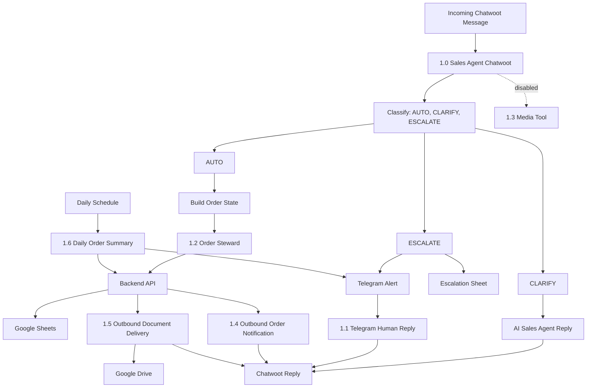

# Workflow Map

## Purpose

Maps the complete n8n workflow suite and the role of each workflow.

## Suite Overview

## `1.0 - SAM - Sales Agent - Chatwoot`

Role: customer-facing sales hub.

Trigger: Chatwoot inbound webhook.

Primary responsibilities:

- accept incoming customer text or audio messages
- block non-customer/loop messages
- normalize Chatwoot IDs and message fields
- transcribe voice notes when present
- fetch and format conversation history
- classify the message into `AUTO`, `CLARIFY`, or `ESCALATE`
- run Sam as the sales agent with sales stock and farm-info tools
- build structured order state from the conversation
- call backend order-intake update and use Phase 5.7 intake readiness for controlled draft creation
- call `1.2 - Amadeus Order Steward` for currently supported order actions
- write escalation records and notify Telegram when human help is needed
- send final replies back to Chatwoot
- manage customer-cancel confirmation state through Chatwoot `pending_action`

Current live order routes called from `1.0`:

- `create_order`
- `create_order_with_lines`
- `update_order`
- `sync_order_lines_from_request`
- `get_order_context` (read-only prefetch when a draft id exists, before AUTO `Code - Build Order State`)
- `cancel_order`
- `send_for_approval`
- `generate_quote`

Current disabled capability:

- `Send_Pictures` tool workflow, which should point to `1.3 - SAM - Sales Agent - Media Tool` when ready.

Phase 5.6 shadow mode - complete and live-verified:

- `Code - Build Intake Shadow Payload` builds a proposed intake patch from the current message after chat history formatting and before the escalation classifier.
- `HTTP - Intake Shadow Update` calls `POST /api/order-intake/update` on the backend.
- `Code - Attach Intake Shadow Result` attaches backend intake status/readiness/missing-field debug data.
- The result is not used for live route selection yet.
- Live verification on 2026-05-12 created intake `INTAKE-2026-4D7825` for conversation `1774` and updated it to `Ready_For_Draft` after the follow-up commitment message.

Phase 5.7 intake-driven draft creation - complete and live-verified:

- Use `intake_shadow_result.ready_for_draft = true` and `next_action = create_draft` as the first backend-intake-driven draft creation trigger.
- Prefer calling existing `1.2` create-with-lines behavior rather than duplicating order-writing logic in `1.0`.
- Keep current route behavior as fallback until the intake-driven path is live-verified.
- `Code - Attach Intake Shadow Result` feeds both the escalation classifier and `Merge - Sales Agent Context A`, so intake fields survive the normal sales-agent context path and are available to route decision.
- After successful draft creation, `Code - Build Intake Draft Link Payload` and `HTTP - Link Intake Draft Order` patch `ORDER_INTAKE_STATE.Draft_Order_ID` through `POST /api/order-intake/update`.
- Live verification on 2026-05-12 created `ORD-2026-A822D3` from intake `INTAKE-2026-4D7825` and synced one active Female Grower `35_to_39_Kg` line.
- Follow-up atomic-path verification on 2026-05-13 proved the backend `POST /api/master/orders/create-with-lines` boundary cancels a newly created draft when requested items produce no stock-line match (`ORD-2026-CBAE14`), so no active zero-line draft remains.
- Cleanup is required after intake-driven flows are proven: remove duplicate shadow/legacy route fallbacks and keep intake state as the primary order-intake truth.

## `1.1 - SAM - Sales Agent - Escalation Telegram`

Role: async human reply workflow.

Trigger: Telegram message from the approved human chat.

Primary responsibilities:

- parse the human Telegram reply and ticket ID
- retrieve escalation ticket detail from the handoff sheet
- polish the human reply without changing meaning
- send the answer to the correct Chatwoot conversation
- update the escalation sheet status
- return the Chatwoot conversation to `conversation_mode = AUTO`
- delete Telegram messages after reply when implemented

Relationship to `1.0`: coordinated through Telegram and the escalation sheet, not through direct `Execute Workflow` calls.

## `1.2 - Amadeus Order Steward`

Role: order action worker.

Trigger: executed by another workflow, mainly `1.0`.

Primary responsibilities for current `1.0` use:

- normalize incoming action payloads
- route by `action`
- call backend API endpoints
- return structured success/error responses to `1.0`

Currently documented as live for `1.0` only:

- `create_order`
- `create_order_with_lines`
- `update_order`
- `sync_order_lines_from_request`
- `get_order_context`
- `cancel_order`
- `send_for_approval`
- `generate_quote`

Other actions present in the workflow should be treated as steward capability or test/planned paths until `1.0` actively calls them.

Customer cancel routing uses `CANCEL_PENDING`, `CANCEL_ORDER`, and `CLEAR_PENDING` inside `1.0`, with the actual cancellation executed through `1.2` and the backend.

First-turn committed orders with non-empty `requested_items[]` use `create_order_with_lines`. `1.0` chooses the action, while `1.2` calls backend `POST /api/master/orders/create-with-lines` and returns one combined success result. The backend owns the atomic create + line-sync behavior and cancels a newly created draft if no active order lines can be synced.

Formal quote requests with an existing draft use `generate_quote`. `1.0` chooses the route from backend intake `next_action = generate_quote` or from a detected quote request with enough draft context. `1.2` calls backend `POST /api/orders/<order_id>/quote`; it does not send the document to the customer.

Order context today: `get_order_context` in `1.2` calls `GET /api/orders/<id>` and returns slim header + line metadata to `1.0` for merge in `Code - Build Order State`.

Preferred direction for richer review UIs: keep using `1.2` and backend endpoints rather than giving Sam direct `ORDER_OVERVIEW` sheet tools.

## `1.3 - SAM - Sales Agent - Media Tool`

Role: image/media sender.

Trigger: executed as a tool workflow when enabled.

Current status: disabled until fixed and tested.

Primary responsibilities when enabled:

- receive `account_id`, `conversation_id`, `inbox_id`, `category_key`, `send_mode`, and `count`
- map media category to Google Drive folder
- find eligible images
- send images to Chatwoot
- update `images_sent_offset_map` so repeat requests do not resend the same images unnecessarily

## `1.4 - Outbound Order Notification`

Role: backend-triggered customer notification workflow.

Trigger: webhook called by Flask through `ORDER_NOTIFICATION_WEBHOOK_URL` after a successful approval or rejection.

Primary responsibilities:

- receive `event_type`, `order_id`, `conversation_id`, `message_text`, customer metadata, and extra transition context from backend
- validate that `event_type` is one of `order_approved` or `order_rejected`
- require `conversation_id` before sending to Chatwoot
- send the exact backend-provided `message_text` to the Chatwoot conversation
- return structured success/error details to backend

Relationship to `1.0`: separate outbound workflow. `1.0` remains the inbound sales hub and does not own post-approval/rejection messages.

## `1.5 - Outbound Document Delivery`

Role: backend-triggered quote/invoice PDF delivery workflow.

Trigger: webhook called by Flask through `DOCUMENT_DELIVERY_WEBHOOK_URL` after a generated document is selected for delivery.

Primary responsibilities:

- receive `document_id`, `conversation_id`, `google_drive_file_id`, `file_name`, and `message_text` from backend
- validate required delivery fields
- download the PDF from Google Drive using authenticated Google Drive access
- send the PDF to Chatwoot as an outgoing attachment
- return structured success/error details to backend

Relationship to `1.0`: separate outbound workflow. `1.0` does not calculate document totals, generate PDFs, or send quote/invoice files independently.

## `1.6 - Daily Order Summary`

Role: scheduled operations report.

Trigger: n8n schedule trigger, with a manual trigger for testing.

Primary responsibilities:

- call `GET /api/reports/daily-summary`
- format the backend response into a concise operations message
- send the summary to the approved Telegram admin chat
- avoid direct Google Sheets reads for order summary data

Relationship to order workflows: read-only reporting path. It does not change orders, documents, reservations, or Chatwoot conversations.

## Change Rule

Any structural workflow change must update this map and the affected workflow README.
