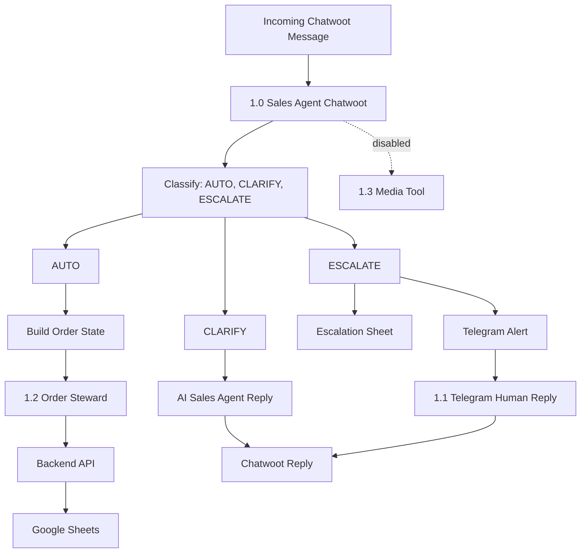

# Workflow Map

## Purpose

Maps the complete n8n workflow suite and the role of each workflow.

## Suite Overview

## `1.0 - SAM - Sales Agent - Chatwoot`

Role: customer-facing sales hub.

Trigger: Chatwoot inbound webhook.

Primary responsibilities:

- accept incoming customer text or audio messages
- block non-customer/loop messages
- normalize Chatwoot IDs and message fields
- transcribe voice notes when present
- fetch and format conversation history
- classify the message into `AUTO`, `CLARIFY`, or `ESCALATE`
- run Sam as the sales agent with sales stock and farm-info tools
- build structured order state from the conversation
- call `1.2 - Amadeus Order Steward` for currently supported order actions
- write escalation records and notify Telegram when human help is needed
- send final replies back to Chatwoot
- manage customer-cancel confirmation state through Chatwoot `pending_action`

Current live order routes called from `1.0`:

- `create_order`
- `update_order`
- `sync_order_lines_from_request`
- `cancel_order`

Current disabled capability:

- `Send_Pictures` tool workflow, which should point to `1.3 - SAM - Sales Agent - Media Tool` when ready.

## `1.1 - SAM - Sales Agent - Escalation Telegram`

Role: async human reply workflow.

Trigger: Telegram message from the approved human chat.

Primary responsibilities:

- parse the human Telegram reply and ticket ID
- retrieve escalation ticket detail from the handoff sheet
- polish the human reply without changing meaning
- send the answer to the correct Chatwoot conversation
- update the escalation sheet status
- return the Chatwoot conversation to `conversation_mode = AUTO`
- delete Telegram messages after reply when implemented

Relationship to `1.0`: coordinated through Telegram and the escalation sheet, not through direct `Execute Workflow` calls.

## `1.2 - Amadeus Order Steward`

Role: order action worker.

Trigger: executed by another workflow, mainly `1.0`.

Primary responsibilities for current `1.0` use:

- normalize incoming action payloads
- route by `action`
- call backend API endpoints
- return structured success/error responses to `1.0`

Currently documented as live for `1.0` only:

- `create_order`
- `update_order`
- `sync_order_lines_from_request`
- `cancel_order`

Other actions present in the workflow should be treated as steward capability or test/planned paths until `1.0` actively calls them.

Customer cancel routing uses `CANCEL_PENDING`, `CANCEL_ORDER`, and `CLEAR_PENDING` inside `1.0`, with the actual cancellation executed through `1.2` and the backend.

Preferred future order-review direction:

- Add/review an order lookup action through `1.2` and the backend rather than giving Sam direct operational access to `ORDER_OVERVIEW`.
- The backend can read `ORDER_OVERVIEW` or order endpoints safely and return only the customer-relevant order context.

## `1.3 - SAM - Sales Agent - Media Tool`

Role: image/media sender.

Trigger: executed as a tool workflow when enabled.

Current status: disabled until fixed and tested.

Primary responsibilities when enabled:

- receive `account_id`, `conversation_id`, `inbox_id`, `category_key`, `send_mode`, and `count`
- map media category to Google Drive folder
- find eligible images
- send images to Chatwoot
- update `images_sent_offset_map` so repeat requests do not resend the same images unnecessarily

## Change Rule

Any structural workflow change must update this map and the affected workflow README.
